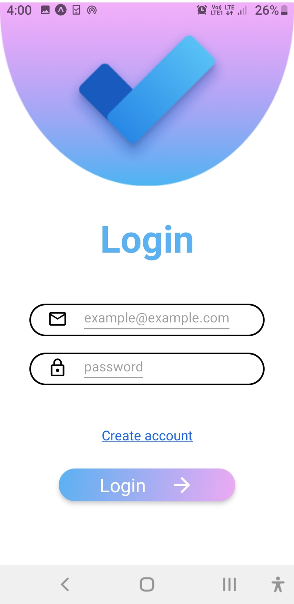

# Task List made with ## React Native and Firebase

This app provides email and password authentication 

```bash
npm install
```
## Install  expo by excecuting 

```bash
npm install expo-cli
```

## Run the app

```bash
expo start 
```
## Or
```bash
npm start
```
# Some of the demo screen shots of the app


